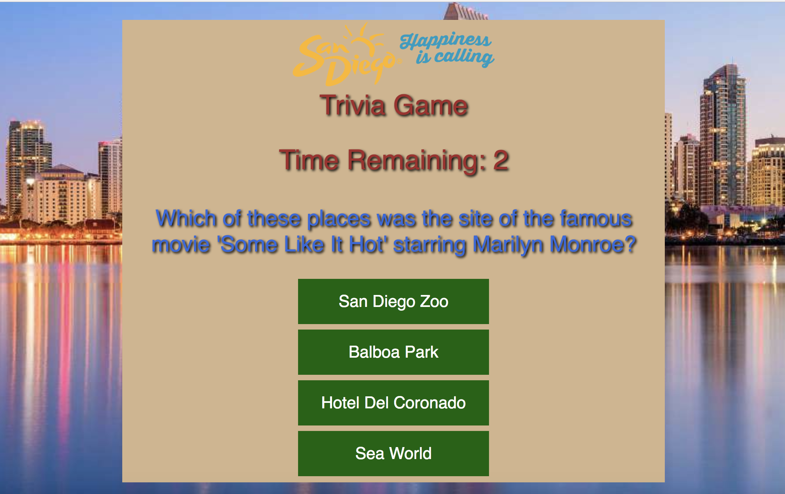
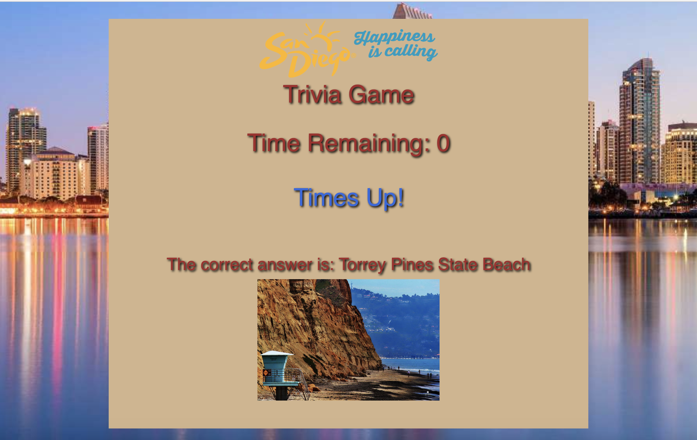

# San Diego Trivia Game

This a game is a standard, single-player trivia game where you select one of a multiple choice of answers.

## Description 

The game starts when the user hits the start button.  They are then shown a trivia question and choices of possible answers.

 
They have 20 seconds to answer the question and we indicate if they get it right or wrong.  At the end of the game, statistics are shown which have how many correct, incorrect and unanswered questions the player received.

### Usage instructions

Player presses start to begin.  They click on one answer for each question asked.  At the end the game, the player can click the "Start Over??" button to play again.
